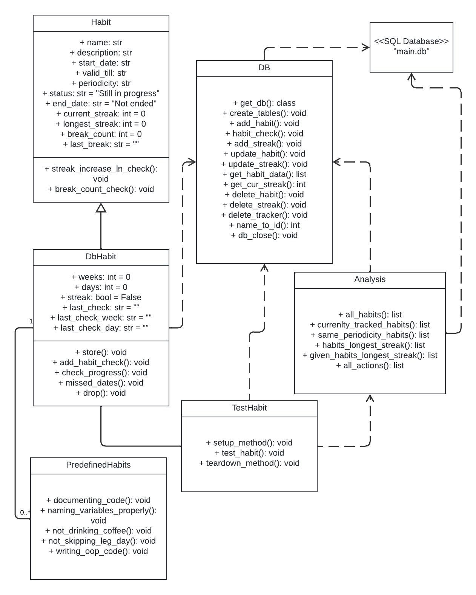

# Task and Solution

The goal was to develop a habit tracker application, that would help users build and maintain habits, track progress, and stay motivated. 
The core idea was to provide a simple yet feature-rich application for creating, managing, and analyzing habits. However, it was important to keep in mind limited advanced database capabilities. 
The *PyCharm IDE* was used because it provides intelligent code completion. This feature saves time and reduces errors by offering relevant suggestions based on the context of the code. The *Jupiter Notebook* was considered as an alternative, but it’d be inconvenient to use it for this type of project. 
The *sqlite3* module was used for storing data purposes because *sqlite3* provides an interface for accessing *SQLite* databases. *SQLite* is built into *Python* – installing anything extra was unnecessary. An alternative was to store data in the Python lists, via the help of *Pandas*, *Python’s module*, but working with *SQL* databases is less time-consuming and considered more versatile. 
The Solution was designed step by step. 
My initial plan was to create a *Habit*, *DB*, *Analysis* and *Test* classes, and the *main.py*, from which the **user** would create, check-off, and analyze habits. But as I started developing the project I started to think from the perspective of a **user**: *how comfortable would it be for a user to use the application?*

# Development phase

First things first, I started implementing the habit classes and in parallel was implementing the *DB* class.
At the start, the *DbHabit* class had next variables: name, description, starting date, expiration date, periodicity type, status, ending date, current streak, longest streak, break count, last break, streak, last check, and a database consisted of 3 tables *Habit*, in which main data describing the habit were stored, *streak*, in which were stored: current streak, longest streak, break count, last break, and a *Tracker*, in which were: id, habit’s id, date, check-off were stored. 
The concept was next, the **user** is able to create a certain habit, for example, a habit called “run”, and after completing or breaking the habit, **user** is able to create another habit called “run”, and data extraction would have not been a problem since the habit would have had a status “Still in progress”, and other habits called “run”, either “Completed” or “Broken”. But such a concept would have been hard to implement because the system does not interact with global time, but calculates the time when the **user** checks-off a habit, entering check-off date. So was decided to stick with the concept: only one habit with the same name is allowed, despite its status. 
After creating the method store in the *DbHabit* class, which calls add habit in the *DB* class, which in turn inserts habit data into the dataset, it was needed to create a check-off method. The *add_habit_check* method in the *DbHabit* class not only checks-off a habit by inserting the data into the dataset but also checks all days or weeks, the **user** has forgotten to check-off a habit. At this point, it was decided to add boolean variables *days* and *weeks* needed for reducing the code lines in the *missed_dates()*. 
After the habits and the *DB* classes were finished, I started to implement the *Test* class for the unit tests and the *Analysis* class for the analysis methods. It was also logical to add the *PredefinedHabits* class, consisting of certain methods, which create habits with at least 4 weeks of check-off history. 
It was left only to write the *main.py*. When the **user** wants to check-off a habit the system extracts essential data from the database and passes it to the method *add_habit_check* of the *DbHabit* class. 
For better understanding here is the class diagram:  

# Evaluation of result

Evaluating my own project after its completion the conclusion is as follows: it would be better to add the check-off class for clearer programming code. The application works correctly and has understandable CLI, but if there was a check-off class the code in the *main.py* would be cleaner. Also, it would be better if the user had the opportunity to create the same habit of different periodicity types. 
However, despite all the disadvantages, the **Habit Tracker** application works properly and fulfills all the requirements and project goals. I will use this application myself and continue improving it!

# Conclusion and outlook

The **Habit Tracker** application allows users to define habits with different periodicities, check-off them, delete them, and analyze them. 
Currently, the application is executed through the command line by writing the command: `Python code/main.py`. Therefore, to run the application, *Python* should be installed. The Habit Tracker also lacks an interactive GUI. The plan for the future is to develop the **_.exe_**, **_.apk_**, and **_.ipa_** extensions for *Windows*, *Android*, and *iPhone* users, respectively. 
